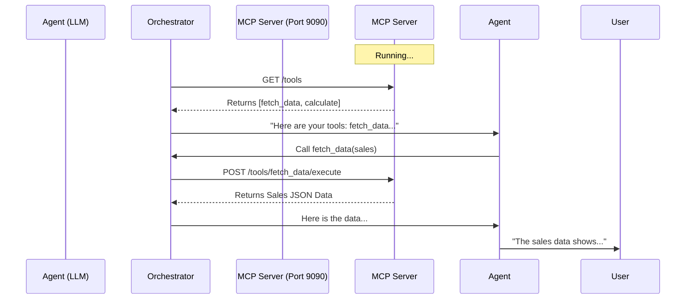

# MCP Integration Walkthrough

This document explains **Model Context Protocol (MCP)** integration in the YAML Multi-Agent Orchestrator. It allows agents to use external tools (like weather, calculators, or databases) securely.

## 1. The MCP Server (`mcp_server.py`)
The server provides the actual tools. It's a simple Flask app that exposes tool definitions and handles execution requests.

### Key Components:
- **`TOOLS` List**: Defines the available tools (name, description, parameters schema).
- **`/tools` Endpoint**: Returns the list of tools so the agent knows what it can do.
- **`/tools/<name>/execute` Endpoint**: Receives tool calls and returns results.

#### Example Tool Definition in Python:
```python
{
    "name": "get_weather",
    "description": "Get current weather for a city",
    "parameters": {
        "type": "object",
        "properties": {
            "city": {"type": "string"}
        },
        "required": ["city"]
    }
}
```

## 2. YAML Configuration (`03_tool_enabled_data_analysis.yaml`)
The YAML file bridges the agent and the server.

### Connecting the Server:
First, we tell the orchestrator where the server lives.
```yaml
mcp_servers:
  - id: data_tools           # Internal ID for this server
    url: "http://localhost:9090"
    auto_discover: true      # Automatically fetch all available tools
```

### Assigning Tools to Agents:
Then, we give an agent access to those tools using the `mcp:` prefix.
```yaml
agents:
  - id: data_collector
    role: Data Specialist
    tools:
      - mcp:data_tools       # Gives access to ALL tools from 'data_tools' server
```

## 3. How It Works (The Flow)

1.  **Start Server**: You run `python3 mcp_server.py`. It listens on port 9090.
2.  **Orchestrator Init**: When you run `run.py`, it parses the YAML.
3.  **Discovery**: It sees `mcp_servers`, connects to `http://localhost:9090/tools`, and downloads the tool definitions (get_weather, calculate, fetch_data).
4.  **Agent Prompting**: The orchestrator converts these tool definitions into a format the LLM understands (e.g., OpenAI function calling schema) and attaches them to the agent's system prompt.
5.  **Execution**:
    *   The Agent decides to call a tool (e.g., `fetch_data(data_type="sales")`).
    *   The Orchestrator intercepts this request.
    *   The Orchestrator sends a POST request to `http://localhost:9090/tools/fetch_data/execute` with the parameters.
    *   The Orchestrator gets the result (JSON) and feeds it back to the Agent.
    *   The Agent uses the data to answer the user's query.

## 4. Why Use This?
- **Decoupling**: Your tools can be in Python, Node.js, or Go running anywhere. The agent doesn't care.
- **Security**: The agent never runs code directly. It just asks the server to do it.
- **Reusability**: Multiple agents can share the same "tool server".

## 5. Summary Diagram


